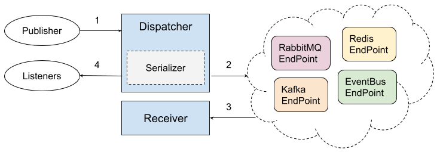

# Background

Event Dispatcher is a core function of Symfony Framework since very earlier version, For other PHP frameworks as well.  
It's a very cool and effecient idea for decoupling modules or functions.  
[symfony-event-dispatcher](https://symfony.com/doc/current/components/event_dispatcher.html) is one of most popular Event Dispatcher implementations in PHP world. It's also being used on other PHP frameworks.

# What's tnc-event-dispatcher?

tnc-event-dispatcher is a alternative of [symfony-event-dispatcher](https://symfony.com/doc/current/components/event_dispatcher.html) for supporting asynchronous and unified structured events. It works as same as symfony-event-dispatcher, has same user interface with a few more options, can replace symfony-event-dispatcher seamlessly.  
 
<a href="assets/tnc_event_dispatcher_workflow.png" target="_blank"></a> 

User cases of tnc-event-dispatcher:

- Heavy Listeners
- Distrubuted Listeners
- Shared Events across multiple systems
- Structred data collecting
- ...

tnc-event-dispatcher includes following core components: **Dispatcher**, **Serializer**, **EndPoint**, **Receiver**.  
It is highly inspired by symfony-event-dispatcher, But not limited on that, symfony-event-dispatcher is one of the Dispatcher implementations of tnc-event-dispatcher, It intends to support other Event Dispatcher implementations as well. 

# How to install?

## Requirements

- PHP 5.6+

## Install From Composer

```sh
> composer install tnc/event-dispatcher
```

# How to use?

```php
<?php
namespace TNC\EventDispatcher;

try {
    /**
     * 1. Initialize Serializer
     * 
     * Serializer is using to serialize your event to be a string.
     * It includes a couple of Normalizers and a Formatter.
     */     
    # Specify Normalizers
    $supportedNormalizers = [
        new Serialization\Normalizers\TNCActivityStreams\TNCActivityStreamsWrappedEventNormalizer(),
        new Serialization\Normalizers\TNCActivityStreams\TNCActivityStreamsNormalizer()
    ];
    # Specify Serialization Format
    $formatter  = new Serialization\Formatters\JsonFormatter();
    # Initialize Serializer
    $serializer = new Serializer($supportedNormalizers, $formatter);


    /**
     * 2. Initialize EndPoint
     * 
     * If you are going to dispatch a async event, which needs a EndPoint to hold the request and send back to Receiver.
     * Mostly the EndPoint is a Queue, such as Redis, Rabbitmq, Kafka or EventBus (https://github .com/thenetcircle/event-bus)
     */
    $endPoint = new EndPoints\EventBusEndPoint('http://localhost:8000');


    /**
     * 3. Initialize tnc-event-dispatcher, And add some Listeners
     */
    $dispatcher = new Dispatchers\SymfonyImpl\EventDispatcher($serializer, $endPoint);
    # Suppose we have a Symfony Event Listener and a Event Subscriber here
    $dispatcher->addListener('message.send', new SymfonyEventListener());
    $dispatcher->addSubscriber(new SymfonyEventSubscriber());

    /**
     * 4. Dispatch Events
     */
    $dispatcher->dispatch(
        'message.send',
        new AsyncEvent(
            [
                'messageId'   => '1',
                'messageBody' => 'abc'
            ]
        )
    );
}
catch (\Exception $e) {
    // Handling Exception
}

/**
 * 5. Receiving and handling the AsyncEvent
 * 
 * After the Event dispatched to the EndPoint, It will be delivered to the Receiver asynchronously.
 * Following are Receiver part, Which could be running on another PHP process
 */
try {
    # Initialize a Receiver(use EventBusReceiver as a example here, could be RabbitMQReceiver, RedisReceiver, ...)
    $receiver = new Receivers\EventBusReceiver();
    # Set Dispatcher we defined before
    $receiver->withDispatcher($dispatcher);
    # Dispatch the serliazed-event we received from the EndPoint
    $receiver->dispatch($serliazedEvent);
}
catch (\Exception $e) {
    // Handling Exception
}
```


# About Contributing
Feedbacks and pull requests are welcome and appreciative. For major changes, please open an issue first to discuss what you would like to change.

# Change Logs
[Click to check Change Logs](change_logs)